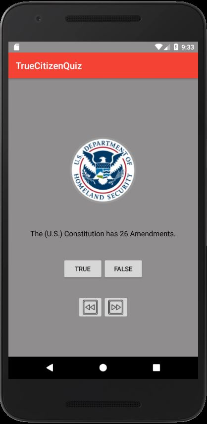
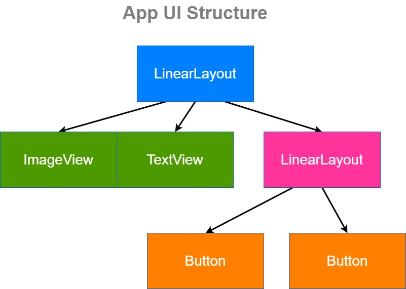
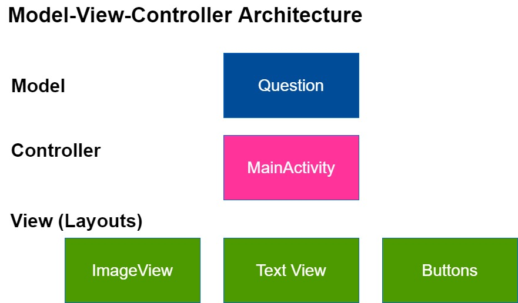
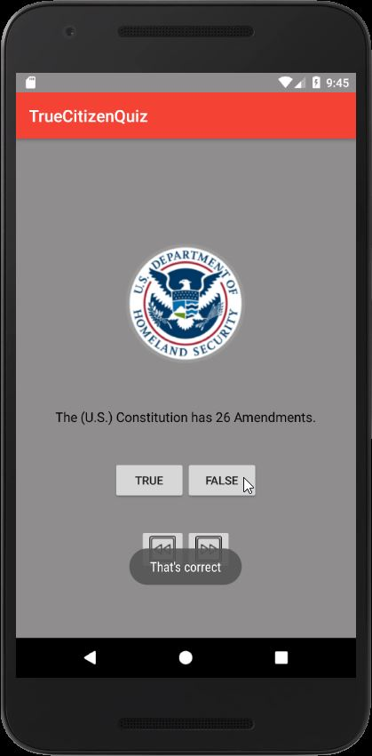
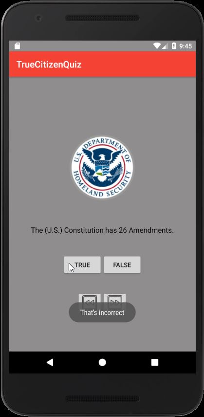
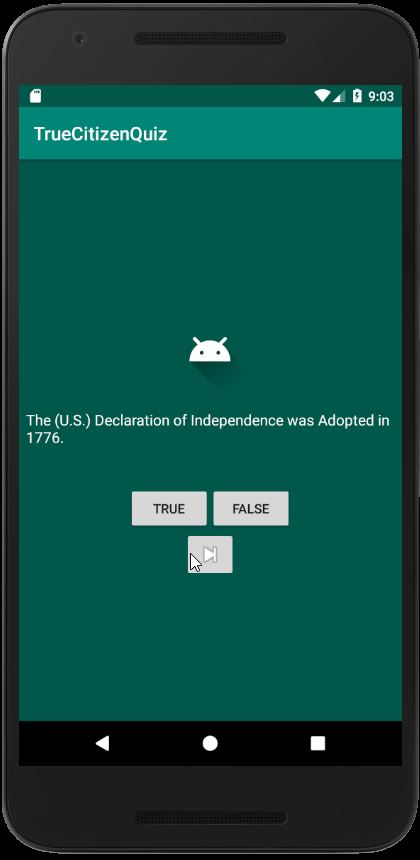

# Project: True Citizen Quiz

**Figure**: True Citizen Quiz Android App

## Overview

<!-- Description of project and purpose. -->

The purpose of this project was to build a Java Android Application
called "True Citizen Quiz", which is based on the question and answer
data from U.S. Citizenship and Immigration Services (USCIS) practice tests 
that help people prepare for the U.S. Citizenship Test. There are a total
of 8 true and false questions that when answered will notify the user
whether their chosen answer was correct or incorrect. Once the user
finishes all 8 questions, the app will loop back to the first question.

## Contents

<!-- folder tree of project and description of directories used -->

- **app**: contains the contents of our Android Application
- **[MainActivity.java](./app/src/main/java/com/guzmanx/truecitizenquiz/MainActivity.java)**:
contains Java source code for the controller part of this project
- **[Question.java](./app/src/main/java/com/guzmanx/truecitizenquiz/Question.java)**:
contains Java source code for the model part of this project
- **gradle**: build automation tool Android Studio uses to build, clean and run the Java application
- **[res](./app/src/main/res)**: contains the resources used in designing the android app user interface. Ex: layout, buttons, text, background, etc
    - [activity_main.xml](./app/src/main/res/layout/activity_main.xml): contains xml styling code
    for Android App UI (also known as View)
    - [strings.xml](./app/src/main/res/values/strings.xml): contains string resources for App UI

## Android App Architecture

<!-- Architecture of App UI Structure

     Model-View-Controller Architecture
 -->

The App User Interface (UI) Structure is as follows:

**Figure**: UI Structure Architecture

For the UI Structure Architecture, first we have the LinearLayout. This layout consists of the ImageView, TextView, nested LinearLayout and ImageButton. In the UI Design, the ImageView is the android icon in the center of the screen. The TextView is the white text statement, the question the quiz taker is trying to get correct. The nested LinearLayout contains the two buttons for true and false that is located below the white text. Then there is the ImageButton that allows the quiz taker to go to the next question and it is located below the two buttons.

Next we have the Model-View-Controller (MVC) Architecture utlized in developing the quiz application:

**Figure**: MVC Architecture

The core class components in MVC Architecture is the Controller (we call ActivityMain.java), which we are constantly using to grab questions from the Model (we call Question.java) and display the question on the View - Layout (we call ActivityMain.xml). The Controller allows the quiz taker to click on the True or False button as the answer to a question that is sent as input back to the Controller, which the Controller then uses the Model to check if the quiz takers' answer is correct. The Model contains the question and it's associated correct answer. The Controller will then display a toast message to the user indicating if their answer was correct by displaying either "That's Correct" or "That's Incorrect" to the screen.

## How To Use Android App

<!-- Instructions on how to interact with android quiz app -->

Launch the Android App from Android Studio by clicking on the Run button. The app consists of True
and False questions:

**Figure**: Question 1 on Amendments

As you can see above, you are presented with a True or False question. Your job is to choose
whether the question is **True or False**. Once you choose your answer, the app will notify you
whether your answer was correct or not.

**Figure**: Selecting False as Answer to Question 1 on Amendments is Correct

For instance in the figure above for question 1, you can see the app notifies you that clicking on
False was the correct answer. However, for question 1, if you were to click on True, the app would
notify you that True was the incorrect answer:

**Figure**: Selecting True as Answer to Question 1 on Amendments is Incorrect

When you are ready to move onto the next question, click on the **next button** below the True and
False button. You will be navigated to the next question on the declaration:

**Figure**: Next Button to Navigate to Question 2 on Declaration

After you answer all 8 questions, the app will loop you back to question 1 to avoid going out of
bounds.

If you need to go to a previous question, click on the previous button, in our case, we are back
at the question 1 on amendments:

If you are on the first question, the previous button will not jump to question 8, it will stay
at question 1.

## Versions

<!-- Dependencies and their versions used in deploying this android app -->

- Android Studio io 3.5.3
- Emulator Nexus 5X API 25

## Resources

<!-- Links to further reading on resources used in helping to build this app -->

- [The Comprehensive 2020 Android Development Masterclass](https://www.udemy.com/course/android-development-java-android-studio-masterclass/)
    - Section 10: Build a Quiz App - MVC Architecture
    - 63 - 70. Building a "True Citizen Quiz" App